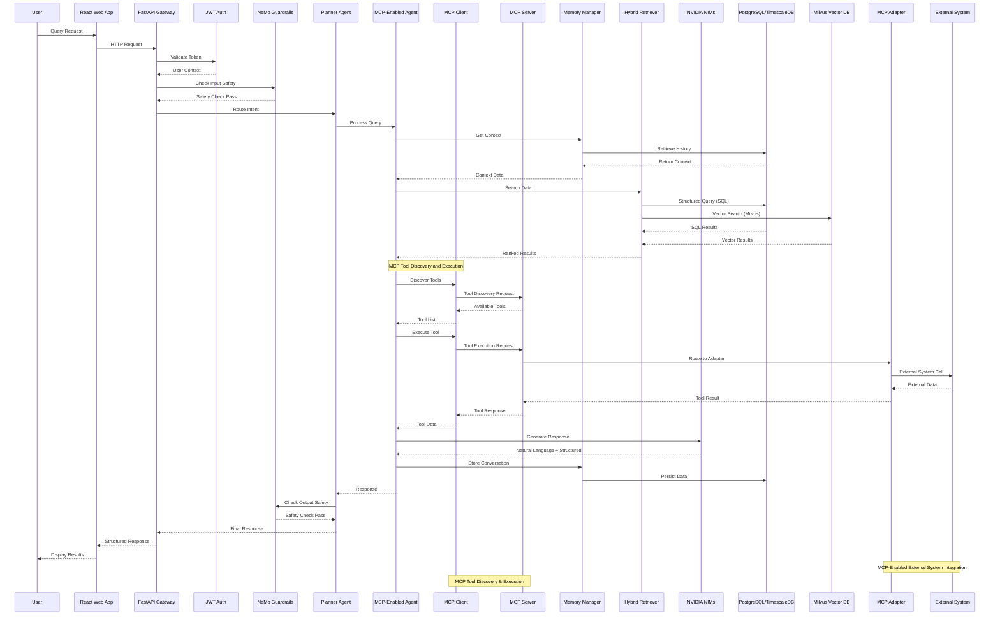

# Warehouse Operational Assistant - Architecture Diagram

## System Architecture Overview

The Warehouse Operational Assistant is a production-grade multi-agent AI system built on NVIDIA AI Blueprints, featuring:

- **Multi-Agent Orchestration**: LangGraph-based planner/router with specialized agents (Equipment, Operations, Safety, Forecasting, Document)
- **NVIDIA NIM Integration**: Cloud or self-hosted NIM endpoints for LLM, embeddings, and document processing
- **MCP Framework**: Model Context Protocol with dynamic tool discovery and execution
- **Hybrid RAG**: PostgreSQL/TimescaleDB + Milvus vector database with intelligent query routing
- **GPU Acceleration**: NVIDIA cuVS for vector search, RAPIDS for forecasting
- **Production-Ready**: Complete monitoring, security, and deployment infrastructure

### Key Architectural Decisions

1. **NVIDIA NIMs**: All AI services use NVIDIA NIMs, which can be deployed as cloud endpoints or self-hosted instances
2. **Hybrid Retrieval**: Combines structured SQL queries with semantic vector search for optimal accuracy
3. **MCP Integration**: Dynamic tool discovery and execution for flexible external system integration
4. **Multi-Agent System**: Specialized agents for different operational domains with centralized planning
5. **GPU Acceleration**: Optional but recommended for production-scale performance

```mermaid
graph TB
    subgraph UI_LAYER["User Interface Layer"]
        UI["React Web App<br/>Port 3001 (0.0.0.0)<br/>Node.js 20+<br/>CRACO + Webpack<br/>Production Ready"]
        Mobile["React Native Mobile<br/>Pending"]
        API_GW["FastAPI Gateway<br/>Port 8001<br/>All Endpoints Working"]
    end

    subgraph SEC_LAYER["Security Layer"]
        Auth["JWT Authentication<br/>Implemented"]
        RBAC["Role-Based Access Control<br/>5 User Roles"]
        Guardrails["NeMo Guardrails<br/>Content Safety"]
    end

    subgraph MCP_LAYER["MCP Integration Layer - Complete"]
        MCP_SERVER["MCP Server<br/>Tool Registration Discovery<br/>Complete"]
        MCP_CLIENT["MCP Client<br/>Multi-Server Communication<br/>Complete"]
        TOOL_DISCOVERY["Tool Discovery Service<br/>Dynamic Tool Registration<br/>Complete"]
        TOOL_BINDING["Tool Binding Service<br/>Intelligent Tool Execution<br/>Complete"]
        TOOL_ROUTING["Tool Routing Service<br/>Advanced Routing Logic<br/>Complete"]
        TOOL_VALIDATION["Tool Validation Service<br/>Error Handling Validation<br/>Complete"]
        SERVICE_DISCOVERY["Service Discovery Registry<br/>Centralized Service Management<br/>Complete"]
        MCP_MONITORING["MCP Monitoring Service<br/>Metrics Health Monitoring<br/>Complete"]
        ROLLBACK_MGR["Rollback Manager<br/>Fallback Recovery<br/>Complete"]
    end

    subgraph AGENT_LAYER["Agent Orchestration - LangGraph + MCP"]
        Planner["MCP Planner Graph<br/>MCP-Enhanced Intent Classification<br/>Fully Integrated"]
        Equipment["MCP Equipment Agent<br/>Dynamic Tool Discovery<br/>Fully Integrated"]
        Operations["MCP Operations Agent<br/>Dynamic Tool Discovery<br/>Fully Integrated"]
        Safety["MCP Safety Agent<br/>Dynamic Tool Discovery<br/>Fully Integrated"]
        Forecasting["MCP Forecasting Agent<br/>Demand Forecasting & Analytics<br/>Production Ready"]
        Document["Document Extraction Agent<br/>6-Stage NVIDIA NeMo Pipeline<br/>Production Ready"]
        Chat["MCP General Agent<br/>Tool Discovery Execution<br/>Fully Integrated"]
    end

    subgraph MEM_LAYER["Memory Management"]
        Memory["Memory Manager<br/>Session Context"]
        Profiles["User Profiles<br/>PostgreSQL"]
        Sessions["Session Context<br/>PostgreSQL"]
        History["Conversation History<br/>PostgreSQL"]
        Redis_Cache["Redis Cache<br/>Session Caching"]
    end

    subgraph AI_LAYER["AI Services - NVIDIA NIMs"]
        NIM_LLM["NVIDIA NIM LLM<br/>Llama 3.3 Nemotron Super 49B<br/>Fully Integrated"]
        NIM_EMB["NVIDIA NIM Embeddings<br/>llama-3_2-nv-embedqa-1b-v2<br/>GPU Accelerated"]
        GUARDRAILS_NIM["NeMo Guardrails<br/>Content Safety & Compliance"]
    end

    subgraph DOC_LAYER["Document Processing Pipeline - NVIDIA NeMo"]
        NEMO_RETRIEVER["NeMo Retriever<br/>Document Preprocessing<br/>Stage 1"]
        NEMO_OCR["NeMoRetriever-OCR-v1<br/>Intelligent OCR<br/>Stage 2"]
        NANO_VL["nemotron-nano-12b-v2-vl<br/>Small LLM Processing<br/>Stage 3"]
        E5_EMBEDDINGS["llama-3_2-nv-embedqa-1b-v2<br/>Embedding Indexing<br/>Stage 4"]
        NEMOTRON_70B["Llama 3.3 Nemotron Super 49B<br/>Large LLM Judge<br/>Stage 5"]
        INTELLIGENT_ROUTER["Intelligent Router<br/>Quality-based Routing<br/>Stage 6"]
    end

    subgraph FORECAST_LAYER["Forecasting System - Production Ready"]
        FORECAST_SERVICE["Forecasting Service<br/>Multi-Model Ensemble"]
        FORECAST_MODELS["ML Models<br/>XGBoost, Random Forest<br/>Gradient Boosting, Ridge, SVR"]
        FORECAST_TRAINING["Training Pipeline<br/>Phase 1-3 + RAPIDS GPU"]
        FORECAST_ANALYTICS["Business Intelligence<br/>Performance Monitoring"]
        REORDER_ENGINE["Reorder Recommendations<br/>Automated Stock Orders"]
    end

    subgraph RAG_LAYER["Hybrid Retrieval - RAG"]
        SQL["Structured Retriever<br/>PostgreSQL TimescaleDB<br/>90%+ Routing Accuracy"]
        Vector["Vector Retriever<br/>Milvus Semantic Search<br/>GPU Accelerated cuVS"]
        Hybrid["Hybrid Ranker<br/>Context Synthesis<br/>Evidence Scoring"]
    end

    subgraph CORE_SVC["Core Services"]
        WMS_SVC["WMS Integration Service<br/>SAP EWM Manhattan Oracle"]
        IoT_SVC["IoT Integration Service<br/>Equipment Environmental"]
        Metrics["Prometheus Metrics<br/>Performance Monitoring"]
    end

    subgraph CHAT_SVC["Chat Enhancement Services - Production Ready"]
        PARAM_VALIDATOR["Parameter Validation Service<br/>MCP Tool Parameter Validation<br/>Implemented"]
        RESPONSE_FORMATTER["Response Formatting Engine<br/>Clean User-Friendly Responses<br/>Implemented"]
        CONVERSATION_MEMORY["Conversation Memory Service<br/>Persistent Context Management<br/>Implemented"]
        EVIDENCE_COLLECTOR["Evidence Collection Service<br/>Context Source Attribution<br/>Implemented"]
        QUICK_ACTIONS["Smart Quick Actions Service<br/>Contextual Action Suggestions<br/>Implemented"]
        RESPONSE_VALIDATOR["Response Validation Service<br/>Quality Assurance Enhancement<br/>Implemented"]
        MCP_TESTING["Enhanced MCP Testing Dashboard<br/>Advanced Testing Interface<br/>Implemented"]
    end

    subgraph STORAGE["Data Storage"]
        Postgres[("PostgreSQL TimescaleDB<br/>Structured Data Time Series<br/>Port 5435")]
        Milvus[("Milvus GPU<br/>Vector Database<br/>NVIDIA cuVS Accelerated<br/>Port 19530")]
        Redis[("Redis<br/>Cache Sessions<br/>Port 6379")]
        MinIO[("MinIO<br/>Object Storage<br/>Port 9000")]
    end

    subgraph ADAPTERS["MCP Adapters - Complete"]
        ERP_ADAPTER["ERP Adapter<br/>SAP ECC Oracle<br/>10+ Tools<br/>Complete"]
        WMS_ADAPTER["WMS Adapter<br/>SAP EWM Manhattan Oracle<br/>15+ Tools<br/>Complete"]
        IoT_ADAPTER["IoT Adapter<br/>Equipment Environmental Safety<br/>12+ Tools<br/>Complete"]
        RFID_ADAPTER["RFID Barcode Adapter<br/>Zebra Honeywell Generic<br/>10+ Tools<br/>Complete"]
        ATTENDANCE_ADAPTER["Time Attendance Adapter<br/>Biometric Card Mobile<br/>8+ Tools<br/>Complete"]
        FORECAST_ADAPTER["Forecasting Adapter<br/>Demand Forecasting Tools<br/>6+ Tools<br/>Complete"]
    end

    subgraph INFRA["Infrastructure"]
        Kafka["Apache Kafka<br/>Event Streaming<br/>Port 9092"]
        Etcd["etcd<br/>Configuration Management<br/>Port 2379"]
        Docker["Docker Compose<br/>Container Orchestration"]
    end

    subgraph MONITORING["Monitoring and Observability"]
        Prometheus["Prometheus<br/>Metrics Collection<br/>Port 9090"]
        Grafana["Grafana<br/>Dashboards Visualization<br/>Port 3000"]
        AlertManager["AlertManager<br/>Alert Management<br/>Port 9093"]
        NodeExporter["Node Exporter<br/>System Metrics"]
        Cadvisor["cAdvisor<br/>Container Metrics"]
    end

    subgraph API_LAYER["API Endpoints"]
        CHAT_API["/api/v1/chat<br/>AI-Powered Chat"]
        EQUIPMENT_API["/api/v1/equipment<br/>Equipment Asset Management"]
        INVENTORY_API["/api/v1/inventory<br/>Inventory Management"]
        OPERATIONS_API["/api/v1/operations<br/>Workforce Tasks"]
        SAFETY_API["/api/v1/safety<br/>Incidents Policies"]
        FORECAST_API["/api/v1/forecasting<br/>Demand Forecasting"]
        TRAINING_API["/api/v1/training<br/>Model Training"]
        WMS_API["/api/v1/wms<br/>External WMS Integration"]
        ERP_API["/api/v1/erp<br/>ERP Integration"]
        IOT_API["/api/v1/iot<br/>IoT Sensor Data"]
        SCANNING_API["/api/v1/scanning<br/>RFID Barcode Scanning"]
        ATTENDANCE_API["/api/v1/attendance<br/>Time Attendance"]
        REASONING_API["/api/v1/reasoning<br/>AI Reasoning"]
        AUTH_API["/api/v1/auth<br/>Authentication"]
        HEALTH_API["/api/v1/health<br/>System Health"]
        MCP_API["/api/v1/mcp<br/>MCP Tool Management & Testing"]
        DOCUMENT_API["/api/v1/document<br/>Document Processing Pipeline"]
        MIGRATION_API["/api/v1/migrations<br/>Database Migrations"]
    end

    UI --> API_GW
    Mobile -.-> API_GW
    API_GW --> AUTH_API
    API_GW --> CHAT_API
    API_GW --> EQUIPMENT_API
    API_GW --> INVENTORY_API
    API_GW --> OPERATIONS_API
    API_GW --> SAFETY_API
    API_GW --> FORECAST_API
    API_GW --> TRAINING_API
    API_GW --> WMS_API
    API_GW --> ERP_API
    API_GW --> IOT_API
    API_GW --> SCANNING_API
    API_GW --> ATTENDANCE_API
    API_GW --> REASONING_API
    API_GW --> HEALTH_API
    API_GW --> MCP_API
    API_GW --> DOCUMENT_API
    API_GW --> MIGRATION_API

    AUTH_API --> Auth
    Auth --> RBAC
    RBAC --> Guardrails
    Guardrails --> Planner

    MCP_API --> MCP_SERVER
    MCP_SERVER --> TOOL_DISCOVERY
    MCP_SERVER --> TOOL_BINDING
    MCP_SERVER --> TOOL_ROUTING
    MCP_SERVER --> TOOL_VALIDATION
    MCP_SERVER --> SERVICE_DISCOVERY
    MCP_SERVER --> MCP_MONITORING
    MCP_SERVER --> ROLLBACK_MGR

    MCP_CLIENT --> MCP_SERVER
    MCP_CLIENT --> ERP_ADAPTER
    MCP_CLIENT --> WMS_ADAPTER
    MCP_CLIENT --> IoT_ADAPTER
    MCP_CLIENT --> RFID_ADAPTER
    MCP_CLIENT --> ATTENDANCE_ADAPTER
    MCP_CLIENT --> FORECAST_ADAPTER

    Planner --> Equipment
    Planner --> Operations
    Planner --> Safety
    Planner --> Forecasting
    Planner --> Document
    Planner --> Chat

    Equipment --> MCP_CLIENT
    Operations --> MCP_CLIENT
    Safety --> MCP_CLIENT
    Forecasting --> MCP_CLIENT
    Equipment --> TOOL_DISCOVERY
    Operations --> TOOL_DISCOVERY
    Safety --> TOOL_DISCOVERY
    Forecasting --> TOOL_DISCOVERY

    Equipment --> Memory
    Operations --> Memory
    Safety --> Memory
    Forecasting --> Memory
    Chat --> Memory
    Document --> Memory
    Memory --> Profiles
    Memory --> Sessions
    Memory --> History
    Memory --> Redis_Cache

    Document --> NEMO_RETRIEVER
    NEMO_RETRIEVER --> NEMO_OCR
    NEMO_OCR --> NANO_VL
    NANO_VL --> E5_EMBEDDINGS
    E5_EMBEDDINGS --> NEMOTRON_70B
    NEMOTRON_70B --> INTELLIGENT_ROUTER
    INTELLIGENT_ROUTER --> Document

    FORECAST_API --> FORECAST_SERVICE
    TRAINING_API --> FORECAST_TRAINING
    FORECAST_SERVICE --> FORECAST_MODELS
    FORECAST_SERVICE --> FORECAST_ANALYTICS
    FORECAST_SERVICE --> REORDER_ENGINE
    FORECAST_TRAINING --> Postgres
    FORECAST_ANALYTICS --> Postgres
    REORDER_ENGINE --> Postgres

    Equipment --> SQL
    Operations --> SQL
    Safety --> SQL
    Forecasting --> SQL
    Chat --> SQL
    Document --> SQL
    Equipment --> Vector
    Operations --> Vector
    Safety --> Vector
    Forecasting --> Vector
    Chat --> Vector
    Document --> Vector
    SQL --> Postgres
    Vector --> Milvus
    SQL --> Hybrid
    Vector --> Hybrid
    NIM_EMB --> Vector
    Hybrid --> NIM_LLM

    Chat --> PARAM_VALIDATOR
    Chat --> RESPONSE_FORMATTER
    Chat --> CONVERSATION_MEMORY
    Chat --> EVIDENCE_COLLECTOR
    Chat --> QUICK_ACTIONS
    Chat --> RESPONSE_VALIDATOR
    MCP_API --> MCP_TESTING
    PARAM_VALIDATOR --> MCP_CLIENT
    RESPONSE_FORMATTER --> Chat
    CONVERSATION_MEMORY --> Memory
    EVIDENCE_COLLECTOR --> Hybrid
    QUICK_ACTIONS --> NIM_LLM
    RESPONSE_VALIDATOR --> RESPONSE_FORMATTER

    WMS_SVC --> WMS_ADAPTER
    IoT_SVC --> IoT_ADAPTER
    Metrics --> Prometheus

    Memory --> Postgres
    Memory --> Redis
    WMS_SVC --> MinIO
    IoT_SVC --> MinIO

    ERP_ADAPTER --> ERP_API
    WMS_ADAPTER --> WMS_API
    IoT_ADAPTER --> IOT_API
    RFID_ADAPTER --> SCANNING_API
    ATTENDANCE_ADAPTER --> ATTENDANCE_API
    FORECAST_ADAPTER --> FORECAST_API

    Document --> DOCUMENT_API
    DOCUMENT_API --> NEMO_RETRIEVER
    DOCUMENT_API --> NEMO_OCR
    DOCUMENT_API --> NANO_VL
    DOCUMENT_API --> E5_EMBEDDINGS
    DOCUMENT_API --> NEMOTRON_70B
    DOCUMENT_API --> INTELLIGENT_ROUTER

    MCP_TESTING --> MCP_API
    MCP_API --> MCP_SERVER
    MCP_API --> TOOL_DISCOVERY
    MCP_API --> TOOL_BINDING

    ERP_ADAPTER --> Kafka
    WMS_ADAPTER --> Kafka
    IoT_ADAPTER --> Kafka
    RFID_ADAPTER --> Kafka
    ATTENDANCE_ADAPTER --> Kafka
    FORECAST_ADAPTER --> Kafka
    Kafka --> Postgres
    Kafka --> Milvus

    Postgres --> Prometheus
    Milvus --> Prometheus
    Redis --> Prometheus
    API_GW --> Prometheus
    MCP_MONITORING --> Prometheus
    Prometheus --> Grafana
    Prometheus --> AlertManager
    NodeExporter --> Prometheus
    Cadvisor --> Prometheus

    classDef userLayer fill:#e1f5fe,stroke:#01579b,stroke-width:2px
    classDef securityLayer fill:#fff3e0,stroke:#e65100,stroke-width:2px
    classDef mcpLayer fill:#e8f5e8,stroke:#00D4AA,stroke-width:3px
    classDef agentLayer fill:#f3e5f5,stroke:#4a148c,stroke-width:2px
    classDef memoryLayer fill:#e8f5e8,stroke:#1b5e20,stroke-width:2px
    classDef aiLayer fill:#fff8e1,stroke:#f57f17,stroke-width:2px
    classDef forecastLayer fill:#e1bee7,stroke:#7b1fa2,stroke-width:2px
    classDef dataLayer fill:#fce4ec,stroke:#880e4f,stroke-width:2px
    classDef serviceLayer fill:#e0f2f1,stroke:#00695c,stroke-width:2px
    classDef storageLayer fill:#f1f8e9,stroke:#33691e,stroke-width:2px
    classDef adapterLayer fill:#e3f2fd,stroke:#0d47a1,stroke-width:2px
    classDef infraLayer fill:#fafafa,stroke:#424242,stroke-width:2px
    classDef monitorLayer fill:#fff9c4,stroke:#f9a825,stroke-width:2px
    classDef apiLayer fill:#f3e5f5,stroke:#7b1fa2,stroke-width:2px

    class UI,Mobile,API_GW userLayer
    class Auth,RBAC,Guardrails securityLayer
    class MCP_SERVER,MCP_CLIENT,TOOL_DISCOVERY,TOOL_BINDING,TOOL_ROUTING,TOOL_VALIDATION,SERVICE_DISCOVERY,MCP_MONITORING,ROLLBACK_MGR mcpLayer
    class Planner,Equipment,Operations,Safety,Forecasting,Document,Chat agentLayer
    class Memory,Profiles,Sessions,History,Redis_Cache memoryLayer
    class NIM_LLM,NIM_EMB aiLayer
    class NEMO_RETRIEVER,NEMO_OCR,NANO_VL,E5_EMBEDDINGS,NEMOTRON_70B,INTELLIGENT_ROUTER aiLayer
    class FORECAST_SERVICE,FORECAST_MODELS,FORECAST_TRAINING,FORECAST_ANALYTICS,REORDER_ENGINE forecastLayer
    class SQL,Vector,Hybrid dataLayer
    class WMS_SVC,IoT_SVC,Metrics serviceLayer
    class PARAM_VALIDATOR,RESPONSE_FORMATTER,CONVERSATION_MEMORY,EVIDENCE_COLLECTOR,QUICK_ACTIONS,RESPONSE_VALIDATOR,MCP_TESTING serviceLayer
    class Postgres,Milvus,Redis,MinIO storageLayer
    class ERP_ADAPTER,WMS_ADAPTER,IoT_ADAPTER,RFID_ADAPTER,ATTENDANCE_ADAPTER,FORECAST_ADAPTER adapterLayer
    class Kafka,Etcd,Docker infraLayer
    class Prometheus,Grafana,AlertManager,NodeExporter,Cadvisor monitorLayer
    class CHAT_API,EQUIPMENT_API,INVENTORY_API,OPERATIONS_API,SAFETY_API,FORECAST_API,TRAINING_API,WMS_API,ERP_API,IOT_API,SCANNING_API,ATTENDANCE_API,REASONING_API,AUTH_API,HEALTH_API,MCP_API,DOCUMENT_API,MIGRATION_API apiLayer
```

## Data Flow Architecture with MCP Integration

## Component Status & Implementation Details

### Fully Implemented Components

| Component | Status | Technology | Port | Description |
|-----------|--------|------------|------|-------------|
| **React Web App** | Complete | React 18, Material-UI, CRACO | 3001 | Real-time chat, dashboard, authentication (binds to 0.0.0.0:3001) |
| **FastAPI Gateway** | Complete | FastAPI, Pydantic v2 | 8001 | REST API with OpenAPI/Swagger |
| **JWT Authentication** | Complete | PyJWT, bcrypt | - | 5 user roles, RBAC permissions |
| **NeMo Guardrails** | Complete | NeMo Guardrails | - | Content safety, compliance checks |
| **MCP Integration** | Complete | MCP Protocol | - | Tool discovery, execution, monitoring |
| **MCP Server** | Complete | Python, async | - | Tool registration, discovery, execution |
| **MCP Client** | Complete | Python, async | - | Multi-server communication |
| **Planner Agent** | Complete | LangGraph + MCP | - | Intent classification, routing |
| **Equipment & Asset Operations Agent** | Complete | Python, async + MCP | - | MCP-enabled equipment management |
| **Operations Agent** | Complete | Python, async + MCP | - | MCP-enabled operations management |
| **Safety Agent** | Complete | Python, async + MCP | - | MCP-enabled safety management |
| **Forecasting Agent** | Complete | Python, async + MCP | - | Demand forecasting, reorder recommendations |
| **Document Extraction Agent** | Complete | Python, async + NVIDIA NeMo | - | 6-stage document processing pipeline |
| **Memory Manager** | Complete | PostgreSQL, Redis | - | Session context, conversation history |
| **NVIDIA NIMs** | Complete | Llama 3.3 Nemotron Super 49B, llama-3_2-nv-embedqa-1b-v2 | - | AI-powered responses |
| **Document Processing Pipeline** | Complete | NVIDIA NeMo Models | - | 6-stage intelligent document processing |
| **Forecasting Service** | Complete | Python, scikit-learn, XGBoost | - | Multi-model ensemble forecasting |
| **Forecasting Training** | Complete | Python, RAPIDS cuML (GPU) | - | Phase 1-3 training pipeline |
| **Hybrid Retrieval** | Complete | PostgreSQL, Milvus | - | Structured + vector search |
| **ERP Adapter (MCP)** | Complete | MCP Protocol | - | SAP ECC, Oracle integration |
| **WMS Adapter (MCP)** | Complete | MCP Protocol | - | SAP EWM, Manhattan, Oracle |
| **IoT Adapter (MCP)** | Complete | MCP Protocol | - | Equipment & environmental sensors |
| **RFID/Barcode Adapter (MCP)** | Complete | MCP Protocol | - | Zebra, Honeywell, Generic |
| **Time Attendance Adapter (MCP)** | Complete | MCP Protocol | - | Biometric, Card, Mobile |
| **Forecasting Adapter (MCP)** | Complete | MCP Protocol | - | Demand forecasting tools |
| **Monitoring Stack** | Complete | Prometheus, Grafana | 9090, 3000 | Comprehensive observability |

### Pending Components

| Component | Status | Technology | Description |
|-----------|--------|------------|-------------|
| **React Native Mobile** | Pending | React Native | Handheld devices, field operations |

### API Endpoints

| Endpoint | Method | Status | Description |
|----------|--------|--------|-------------|
| `/api/v1/chat` | POST | Working | AI-powered chat with LLM integration |
| `/api/v1/equipment` | GET/POST | Working | Equipment & asset management, status lookup |
| `/api/v1/operations` | GET/POST | Working | Workforce, tasks, KPIs |
| `/api/v1/safety` | GET/POST | Working | Incidents, policies, compliance |
| `/api/v1/forecasting/dashboard` | GET | Working | Comprehensive forecasting dashboard |
| `/api/v1/forecasting/real-time` | GET | Working | Real-time demand predictions |
| `/api/v1/forecasting/reorder-recommendations` | GET | Working | Automated reorder suggestions |
| `/api/v1/forecasting/model-performance` | GET | Working | Model performance metrics |
| `/api/v1/forecasting/business-intelligence` | GET | Working | Business analytics and insights |
| `/api/v1/forecasting/batch-forecast` | POST | Working | Batch forecast for multiple SKUs |
| `/api/v1/training/history` | GET | Working | Training history |
| `/api/v1/training/start` | POST | Working | Start model training |
| `/api/v1/training/status` | GET | Working | Training status |
| `/api/v1/wms` | GET/POST | Working | External WMS integration |
| `/api/v1/erp` | GET/POST | Working | ERP system integration |
| `/api/v1/iot` | GET/POST | Working | IoT sensor data |
| `/api/v1/scanning` | GET/POST | Working | RFID/Barcode scanning systems |
| `/api/v1/attendance` | GET/POST | Working | Time & attendance tracking |
| `/api/v1/reasoning` | POST | Working | AI reasoning and analysis |
| `/api/v1/auth` | POST | Working | Login, token management |
| `/api/v1/health` | GET | Working | System health checks |
| `/api/v1/mcp` | GET/POST | Working | MCP tool management, discovery, and testing |
| `/api/v1/document` | GET/POST | Working | Document processing pipeline |
| `/api/v1/inventory` | GET/POST | Working | Inventory management |
| `/api/v1/migrations` | GET/POST | Working | Database migrations |

### Infrastructure Components

| Component | Status | Technology | Port | Purpose |
|-----------|--------|------------|------|---------|
| **PostgreSQL/TimescaleDB** | Running | Port 5435 | Structured data, time-series |
| **Milvus** | Running | Port 19530 | Vector database, semantic search |
| **Redis** | Running | Port 6379 | Cache, sessions, pub/sub |
| **Apache Kafka** | Running | Port 9092 | Event streaming, data pipeline |
| **MinIO** | Running | Port 9000 | Object storage, file management |
| **etcd** | Running | Port 2379 | Configuration management |
| **Prometheus** | Running | Port 9090 | Metrics collection |
| **Grafana** | Running | Port 3000 | Dashboards, visualization |
| **AlertManager** | Running | Port 9093 | Alert management |

## Forecasting System Architecture

The Forecasting Agent provides AI-powered demand forecasting with the following capabilities:

### Forecasting Models

- **Random Forest** - 82% accuracy, 15.8% MAPE
- **XGBoost** - 79.5% accuracy, 15.0% MAPE
- **Gradient Boosting** - 78% accuracy, 14.2% MAPE
- **Linear Regression** - 76.4% accuracy, 15.0% MAPE
- **Ridge Regression** - 75% accuracy, 16.3% MAPE
- **Support Vector Regression** - 70% accuracy, 20.1% MAPE

### Model Availability by Phase

| Model | Phase 1 & 2 | Phase 3 |
|-------|-------------|---------|
| Random Forest | ✅ | ✅ |
| XGBoost | ✅ | ✅ |
| Time Series | ✅ | ❌ |
| Gradient Boosting | ❌ | ✅ |
| Ridge Regression | ❌ | ✅ |
| SVR | ❌ | ✅ |
| Linear Regression | ❌ | ✅ |

### Training Pipeline

- **Phase 1 & 2** - Data extraction, feature engineering, basic model training
- **Phase 3** - Advanced models, hyperparameter optimization, ensemble methods
- **GPU Acceleration** - NVIDIA RAPIDS cuML integration for enterprise-scale forecasting (10-100x faster)

### Key Features

- **Real-Time Predictions** - Live demand forecasts with confidence intervals
- **Automated Reorder Recommendations** - AI-suggested stock orders with urgency levels
- **Business Intelligence Dashboard** - Comprehensive analytics and performance monitoring
- **Model Performance Tracking** - Live accuracy, MAPE, drift scores from actual predictions
- **Redis Caching** - Intelligent caching for improved performance

## NVIDIA NIMs Overview

The Warehouse Operational Assistant uses multiple NVIDIA NIMs (NVIDIA Inference Microservices) for various AI capabilities. These can be deployed as cloud endpoints or self-hosted instances.

### NVIDIA NIMs Used in the System

| NIM Service | Model | Purpose | Endpoint Type | Environment Variable | Default Endpoint |
|-------------|-------|---------|---------------|---------------------|------------------|
| **LLM Service** | Llama 3.3 Nemotron Super 49B | Primary language model for chat, reasoning, and generation | Cloud (api.brev.dev) or Self-hosted | `LLM_NIM_URL` | `https://api.brev.dev/v1` |
| **Embedding Service** | llama-3_2-nv-embedqa-1b-v2 | Semantic search embeddings for RAG | Cloud (integrate.api.nvidia.com) or Self-hosted | `EMBEDDING_NIM_URL` | `https://integrate.api.nvidia.com/v1` |
| **NeMo Retriever** | NeMo Retriever | Document preprocessing and structure analysis | Cloud or Self-hosted | `NEMO_RETRIEVER_URL` | `https://integrate.api.nvidia.com/v1` |
| **NeMo OCR** | NeMoRetriever-OCR-v1 | Intelligent OCR with layout understanding | Cloud or Self-hosted | `NEMO_OCR_URL` | `https://integrate.api.nvidia.com/v1` |
| **Nemotron Parse** | Nemotron Parse | Advanced document parsing and extraction | Cloud or Self-hosted | `NEMO_PARSE_URL` | `https://integrate.api.nvidia.com/v1` |
| **Small LLM** | nemotron-nano-12b-v2-vl | Structured data extraction and entity recognition | Cloud or Self-hosted | `LLAMA_NANO_VL_URL` | `https://integrate.api.nvidia.com/v1` |
| **Large LLM Judge** | Llama 3.3 Nemotron Super 49B | Quality validation and confidence scoring | Cloud or Self-hosted | `LLAMA_70B_URL` | `https://integrate.api.nvidia.com/v1` |
| **NeMo Guardrails** | NeMo Guardrails | Content safety and compliance validation | Cloud or Self-hosted | `RAIL_API_KEY` (uses NVIDIA endpoint) | `https://integrate.api.nvidia.com/v1` |

### NIM Deployment Options

| Deployment Type | Description | Use Case | Configuration |
|----------------|-------------|----------|---------------|
| **Cloud Endpoints** | NVIDIA-hosted NIM services | Production deployments, quick setup | Use default endpoints (api.brev.dev or integrate.api.nvidia.com) |
| **Self-Hosted NIMs** | Deploy NIMs on your own infrastructure | Data privacy, cost control, custom requirements | Set custom endpoint URLs (e.g., `http://localhost:8000/v1` or `https://your-nim-instance.com/v1`) |

### Installation Requirements

| Component | Installation Type | Required For | Notes |
|-----------|------------------|--------------|-------|
| **Llama 3.3 Nemotron Super 49B** | Endpoint (Cloud or Self-hosted) | Core LLM functionality, chat, reasoning | Required - Can use cloud endpoint (api.brev.dev) or deploy locally |
| **llama-3_2-nv-embedqa-1b-v2** | Endpoint (Cloud or Self-hosted) | Semantic search, RAG, vector embeddings | Required - Can use cloud endpoint or deploy locally |
| **NeMo Retriever** | Endpoint (Cloud or Self-hosted) | Document preprocessing (Stage 1) | Required for document processing pipeline |
| **NeMoRetriever-OCR-v1** | Endpoint (Cloud or Self-hosted) | OCR processing (Stage 2) | Required for document processing pipeline |
| **Nemotron Parse** | Endpoint (Cloud or Self-hosted) | Document parsing (Stage 2) | Required for document processing pipeline |
| **nemotron-nano-12b-v2-vl** | Endpoint (Cloud or Self-hosted) | Small LLM processing (Stage 3) | Required for document processing pipeline |
| **Llama 3.3 Nemotron Super 49B** | Endpoint (Cloud or Self-hosted) | Quality validation (Stage 5) | Required for document processing pipeline |
| **NeMo Guardrails** | Endpoint (Cloud or Self-hosted) | Content safety and compliance | Required for production deployments |
| **Milvus** | Local Installation | Vector database for embeddings | Required - Install locally or via Docker |
| **PostgreSQL/TimescaleDB** | Local Installation | Structured data storage | Required - Install locally or via Docker |
| **Redis** | Local Installation | Caching and session management | Required - Install locally or via Docker |
| **NVIDIA GPU Drivers** | Local Installation | GPU acceleration for Milvus (cuVS) | Optional but recommended for performance |
| **NVIDIA RAPIDS** | Local Installation | GPU-accelerated forecasting | Optional - For enhanced forecasting performance |

### Endpoint Configuration Guide

**For Cloud Endpoints:**
- Use the default endpoints provided by NVIDIA
- 49B model: `https://api.brev.dev/v1`
- Other NIMs: `https://integrate.api.nvidia.com/v1`
- All use the same `NVIDIA_API_KEY` for authentication

**For Self-Hosted NIMs:**
- Deploy NIMs on your own infrastructure (local or cloud)
- Configure endpoint URLs in `.env` file (e.g., `http://localhost:8000/v1`)
- Ensure endpoints are accessible and properly configured
- Use appropriate API keys for authentication
- See NVIDIA NIM documentation for deployment instructions

**Key Points:**
- All NIMs can be consumed via HTTP/HTTPS endpoints
- You can mix cloud and self-hosted NIMs (e.g., cloud LLM + self-hosted embeddings)
- Self-hosted NIMs provide data privacy and cost control benefits
- Cloud endpoints offer quick setup and managed infrastructure
- The same API key typically works for both cloud endpoints

## Document Processing Pipeline (6-Stage NVIDIA NeMo)

The Document Extraction Agent implements a comprehensive **6-stage pipeline** using NVIDIA NeMo models:

### Stage 1: Document Preprocessing
- **Model**: NeMo Retriever
- **Purpose**: PDF decomposition, image extraction, and document structure analysis
- **Capabilities**: Multi-format support, document type detection, preprocessing optimization

### Stage 2: Intelligent OCR
- **Model**: NeMoRetriever-OCR-v1 + Nemotron Parse
- **Purpose**: Advanced text extraction with layout understanding
- **Capabilities**: Multi-language OCR, table extraction, form recognition, layout preservation

### Stage 3: Small LLM Processing
- **Model**: nemotron-nano-12b-v2-vl
- **Purpose**: Structured data extraction and entity recognition
- **Capabilities**: Entity extraction, data structuring, content analysis, metadata generation

### Stage 4: Embedding & Indexing
- **Model**: llama-3_2-nv-embedqa-1b-v2
- **Purpose**: Vector embedding generation and semantic indexing
- **Capabilities**: Semantic search preparation, content indexing, similarity matching

### Stage 5: Large LLM Judge
- **Model**: Llama 3.3 Nemotron Super 49B
- **Purpose**: Quality validation and confidence scoring
- **Capabilities**: Content validation, quality assessment, confidence scoring, error detection

### Stage 6: Intelligent Routing
- **Model**: Custom routing logic
- **Purpose**: Quality-based routing and result optimization
- **Capabilities**: Result routing, quality optimization, final output generation

## System Capabilities

### Fully Operational Features

- **AI-Powered Chat**: Real-time conversation with NVIDIA NIMs integration
- **Document Processing**: 6-stage NVIDIA NeMo pipeline for intelligent document processing
- **Equipment & Asset Operations**: Equipment availability, maintenance scheduling, asset tracking
- **Operations Coordination**: Workforce scheduling, task management, KPI tracking
- **Safety & Compliance**: Incident reporting, policy lookup, safety checklists, alert broadcasting
- **Demand Forecasting**: Multi-model ensemble forecasting with automated reorder recommendations
- **Authentication & Authorization**: JWT-based auth with 5 user roles and RBAC
- **Content Safety**: NeMo Guardrails for input/output validation
- **Memory Management**: Session context, conversation history, user profiles
- **Hybrid Search**: Structured SQL + vector semantic search (90%+ routing accuracy)
- **WMS Integration**: SAP EWM, Manhattan, Oracle WMS adapters
- **IoT Integration**: Equipment monitoring, environmental sensors, safety systems
- **Monitoring & Observability**: Prometheus metrics, Grafana dashboards, alerting
- **Real-time UI**: React dashboard with live chat interface
- **Chat Enhancement Services**: Parameter validation, response formatting, conversation memory
- **GPU Acceleration**: NVIDIA cuVS for vector search (19x performance), RAPIDS for forecasting

### Planned Features

- **Mobile App**: React Native for handheld devices and field operations

## Technology Stack

| Layer | Technology | Version | Status | Purpose |
|-------|------------|---------|--------|---------|
| **Frontend** | React | 18.2+ | Complete | Web UI with Material-UI |
| **Frontend** | Node.js | 20.0+ (18.17+ min) | Complete | Runtime environment (LTS recommended) |
| **Frontend** | CRACO | 7.1+ | Complete | Webpack configuration override |
| **Frontend** | React Native | - | Pending | Mobile app for field operations |
| **API Gateway** | FastAPI | 0.119+ | Complete | REST API with OpenAPI/Swagger |
| **API Gateway** | Pydantic | v2.7+ | Complete | Data validation & serialization |
| **Orchestration** | LangGraph | Latest | Complete | Multi-agent coordination |
| **AI/LLM** | NVIDIA NIM | Latest | Complete | Llama 3.3 Nemotron Super 49B + Embeddings |
| **Database** | PostgreSQL | 15+ | Complete | Structured data storage |
| **Database** | TimescaleDB | 2.11+ | Complete | Time-series data |
| **Vector DB** | Milvus | 2.3+ | Complete | Semantic search & embeddings |
| **Cache** | Redis | 7+ | Complete | Session management & caching |
| **Streaming** | Apache Kafka | 3.5+ | Complete | Event streaming & messaging |
| **Storage** | MinIO | Latest | Complete | Object storage for files |
| **Config** | etcd | 3.5+ | Complete | Configuration management |
| **Monitoring** | Prometheus | 2.45+ | Complete | Metrics collection |
| **Monitoring** | Grafana | 10+ | Complete | Dashboards & visualization |
| **Monitoring** | AlertManager | 0.25+ | Complete | Alert management |
| **Security** | NeMo Guardrails | Latest | Complete | Content safety & compliance |
| **Security** | JWT/PyJWT | 2.8+ | Complete | Authentication & authorization (key validation enforced) |
| **Security** | bcrypt | Latest | Complete | Password hashing |
| **Security** | aiohttp | 3.13.2 | Complete | HTTP client (client-only, C extensions enabled) |
| **ML/AI** | XGBoost | 1.6+ | Complete | Gradient boosting for forecasting |
| **ML/AI** | scikit-learn | 1.5+ | Complete | Machine learning models |
| **ML/AI** | RAPIDS cuML | Latest | Complete | GPU-accelerated ML (optional) |
| **ML/AI** | Pillow | 10.3+ | Complete | Image processing (document pipeline) |
| **ML/AI** | requests | 2.32.4+ | Complete | HTTP library (patched for security) |
| **Container** | Docker | 24+ | Complete | Containerization |
| **Container** | Docker Compose | 2.20+ | Complete | Multi-container orchestration |

---

This architecture represents a **complete, production-ready warehouse operational assistant** that follows NVIDIA AI Blueprint patterns while providing comprehensive functionality for modern warehouse operations with **full MCP integration**, **GPU acceleration**, **demand forecasting**, and **zero-downtime capabilities**.
