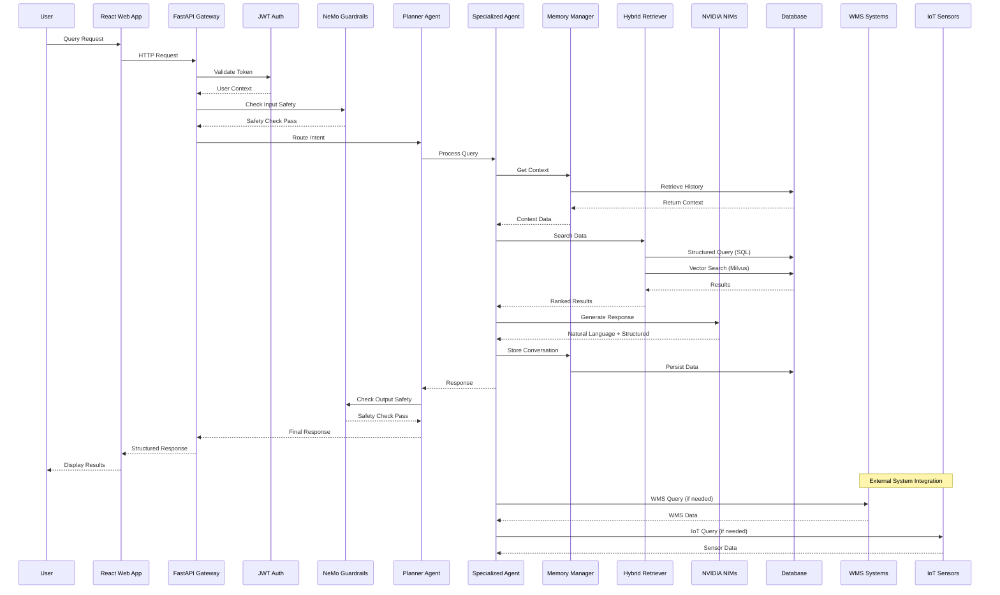

# Warehouse Operational Assistant - Architecture Diagram

## System Architecture Overview

```mermaid
graph TB
    %% User Interface Layer
    subgraph "User Interface Layer"
        UI[React Web App<br/>Port 3001]
        Mobile[React Native Mobile<br/>📱 Pending]
        API_GW[FastAPI Gateway<br/>Port 8001]
    end

    %% Security & Authentication
    subgraph "Security Layer"
        Auth[JWT/OAuth2 Auth<br/>✅ Implemented]
        RBAC[Role-Based Access Control<br/>5 User Roles]
        Guardrails[NeMo Guardrails<br/>Content Safety]
    end

    %% Agent Orchestration Layer
    subgraph "Agent Orchestration (LangGraph)"
        Planner[Planner/Router Agent<br/>Intent Classification]
        Equipment[Equipment & Asset Operations Agent<br/>Equipment Availability & Maintenance & Action Tools<br/>6 Core Equipment Management Tools]
        Operations[Operations Coordination Agent<br/>Workforce & Task Management & Action Tools<br/>8 Comprehensive Operations Management Tools]
        Safety[Safety & Compliance Agent<br/>Incident Reporting, Policies & Action Tools<br/>7 Comprehensive Safety Management Tools]
        Chat[Chat Agent<br/>General Queries]
    end

    %% Memory & Context Management
    subgraph "Memory Management"
        Memory[Memory Manager<br/>Session Context]
        Profiles[User Profiles<br/>PostgreSQL]
        Sessions[Session Context<br/>Redis Cache]
        History[Conversation History<br/>PostgreSQL]
    end

    %% AI Services (NVIDIA NIMs)
    subgraph "AI Services (NVIDIA NIMs)"
        NIM_LLM[NVIDIA NIM LLM<br/>Llama 3.1 70B<br/>✅ Fully Integrated]
        NIM_EMB[NVIDIA NIM Embeddings<br/>NV-EmbedQA-E5-v5<br/>✅ Fully Integrated]
    end

    %% Data Retrieval Layer
    subgraph "Hybrid Retrieval (RAG)"
        SQL[Structured Retriever<br/>PostgreSQL/TimescaleDB]
        Vector[Vector Retriever<br/>Milvus Semantic Search]
        Hybrid[Hybrid Ranker<br/>Context Synthesis]
    end

    %% Core Services
    subgraph "Core Services"
        WMS_SVC[WMS Integration Service<br/>SAP EWM, Manhattan, Oracle]
        IoT_SVC[IoT Integration Service<br/>Equipment & Environmental]
        Metrics[Prometheus Metrics<br/>Performance Monitoring]
    end

    %% Data Storage
    subgraph "Data Storage"
        Postgres[(PostgreSQL/TimescaleDB<br/>Structured Data & Time Series)]
        Milvus[(Milvus<br/>Vector Database)]
        Redis[(Redis<br/>Cache & Sessions)]
        MinIO[(MinIO<br/>Object Storage)]
    end

    %% External System Adapters
    subgraph "External System Adapters"
        WMS_ADAPTERS[WMS Adapters<br/>SAP EWM, Manhattan, Oracle<br/>✅ Implemented]
        IoT_ADAPTERS[IoT Adapters<br/>Equipment, Environmental, Safety<br/>✅ Implemented]
        ERP_ADAPTERS[ERP Adapters<br/>SAP ECC, Oracle<br/>📋 Pending]
        RFID_ADAPTERS[RFID/Barcode Adapters<br/>📋 Pending]
    end

    %% Infrastructure
    subgraph "Infrastructure"
        Kafka[Apache Kafka<br/>Event Streaming]
        Etcd[etcd<br/>Configuration Management]
        Docker[Docker Compose<br/>Container Orchestration]
    end

    %% Monitoring & Observability
    subgraph "Monitoring & Observability"
        Prometheus[Prometheus<br/>Metrics Collection]
        Grafana[Grafana<br/>Dashboards & Visualization]
        AlertManager[AlertManager<br/>Alert Management]
        NodeExporter[Node Exporter<br/>System Metrics]
        Cadvisor[cAdvisor<br/>Container Metrics]
    end

    %% API Endpoints
    subgraph "API Endpoints"
        CHAT_API[/api/v1/chat<br/>AI-Powered Chat]
        EQUIPMENT_API[/api/v1/equipment<br/>Equipment & Asset Management]
        OPERATIONS_API[/api/v1/operations<br/>Workforce & Tasks]
        SAFETY_API[/api/v1/safety<br/>Incidents & Policies]
        WMS_API[/api/v1/wms<br/>External WMS Integration]
        ERP_API[/api/v1/erp<br/>ERP Integration]
        IOT_API[/api/v1/iot<br/>IoT Sensor Data]
        SCANNING_API[/api/v1/scanning<br/>RFID/Barcode Scanning]
        ATTENDANCE_API[/api/v1/attendance<br/>Time & Attendance]
        REASONING_API[/api/v1/reasoning<br/>AI Reasoning]
        AUTH_API[/api/v1/auth<br/>Authentication]
        HEALTH_API[/api/v1/health<br/>System Health]
    end

    %% Connections - User Interface
    UI --> API_GW
    Mobile -.-> API_GW
    API_GW --> AUTH_API
    API_GW --> CHAT_API
    API_GW --> EQUIPMENT_API
    API_GW --> OPERATIONS_API
    API_GW --> SAFETY_API
    API_GW --> WMS_API
    API_GW --> ERP_API
    API_GW --> IOT_API
    API_GW --> SCANNING_API
    API_GW --> ATTENDANCE_API
    API_GW --> REASONING_API
    API_GW --> HEALTH_API

    %% Security Flow
    AUTH_API --> Auth
    Auth --> RBAC
    RBAC --> Guardrails
    Guardrails --> Planner

    %% Agent Orchestration
    Planner --> Equipment
    Planner --> Operations
    Planner --> Safety
    Planner --> Chat

    %% Memory Management
    Equipment --> Memory
    Operations --> Memory
    Safety --> Memory
    Chat --> Memory
    Memory --> Profiles
    Memory --> Sessions
    Memory --> History

    %% Data Retrieval
    Equipment --> SQL
    Operations --> SQL
    Safety --> SQL
    Equipment --> Vector
    Operations --> Vector
    Safety --> Vector
    SQL --> Hybrid
    Vector --> Hybrid
    Hybrid --> NIM_LLM
    NIM_LLM --> NIM_EMB

    %% Core Services
    WMS_SVC --> WMS_ADAPTERS
    IoT_SVC --> IoT_ADAPTERS
    Metrics --> Prometheus

    %% Data Storage
    SQL --> Postgres
    Vector --> Milvus
    Memory --> Redis
    Memory --> Postgres
    WMS_SVC --> MinIO
    IoT_SVC --> MinIO

    %% External System Integration
    WMS_ADAPTERS --> WMS_API
    IoT_ADAPTERS --> IOT_API
    WMS_ADAPTERS --> Kafka
    IoT_ADAPTERS --> Kafka
    ERP_ADAPTERS -.-> Kafka
    RFID_ADAPTERS -.-> Kafka

    %% Event Streaming
    Kafka --> Postgres
    Kafka --> Milvus

    %% Monitoring
    Postgres --> Prometheus
    Milvus --> Prometheus
    Redis --> Prometheus
    API_GW --> Prometheus
    Prometheus --> Grafana
    Prometheus --> AlertManager
    NodeExporter --> Prometheus
    Cadvisor --> Prometheus

    %% Styling
    classDef userLayer fill:#e1f5fe,stroke:#01579b,stroke-width:2px
    classDef securityLayer fill:#fff3e0,stroke:#e65100,stroke-width:2px
    classDef agentLayer fill:#f3e5f5,stroke:#4a148c,stroke-width:2px
    classDef memoryLayer fill:#e8f5e8,stroke:#1b5e20,stroke-width:2px
    classDef aiLayer fill:#fff8e1,stroke:#f57f17,stroke-width:2px
    classDef dataLayer fill:#fce4ec,stroke:#880e4f,stroke-width:2px
    classDef serviceLayer fill:#e0f2f1,stroke:#00695c,stroke-width:2px
    classDef storageLayer fill:#f1f8e9,stroke:#33691e,stroke-width:2px
    classDef externalLayer fill:#e3f2fd,stroke:#0d47a1,stroke-width:2px
    classDef infraLayer fill:#fafafa,stroke:#424242,stroke-width:2px
    classDef monitorLayer fill:#fff9c4,stroke:#f9a825,stroke-width:2px
    classDef apiLayer fill:#f3e5f5,stroke:#7b1fa2,stroke-width:2px

    class UI,Mobile,API_GW userLayer
    class Auth,RBAC,Guardrails securityLayer
    class Planner,Equipment,Operations,Safety,Chat agentLayer
    class Memory,Profiles,Sessions,History memoryLayer
    class NIM_LLM,NIM_EMB aiLayer
    class SQL,Vector,Hybrid dataLayer
    class WMS_SVC,IoT_SVC,Metrics serviceLayer
    class Postgres,Milvus,Redis,MinIO storageLayer
    class WMS_ADAPTERS,IoT_ADAPTERS,ERP_ADAPTERS,RFID_ADAPTERS externalLayer
    class Kafka,Etcd,Docker infraLayer
    class Prometheus,Grafana,AlertManager,NodeExporter,Cadvisor monitorLayer
    class CHAT_API,EQUIPMENT_API,OPERATIONS_API,SAFETY_API,WMS_API,IOT_API,AUTH_API,HEALTH_API,METRICS_API apiLayer
```

## 🛡️ Safety & Compliance Agent Action Tools

The Safety & Compliance Agent now includes **7 comprehensive action tools** for complete safety management:

### **Incident Management Tools**
- **`log_incident`** - Log safety incidents with severity classification and SIEM integration
- **`near_miss_capture`** - Capture near-miss reports with photo upload and geotagging

### **Safety Procedure Tools**
- **`start_checklist`** - Manage safety checklists (forklift pre-op, PPE, LOTO)
- **`lockout_tagout_request`** - Create LOTO procedures with CMMS integration
- **`create_corrective_action`** - Track corrective actions and assign responsibilities

### **Communication & Training Tools**
- **`broadcast_alert`** - Multi-channel safety alerts (PA, Teams/Slack, SMS)
- **`retrieve_sds`** - Safety Data Sheet retrieval with micro-training

### **Example Safety Workflow**
```
User Query: "Machine over-temp event detected"
Agent Actions:
1. ✅ broadcast_alert - Emergency alert (Tier 2)
2. ✅ lockout_tagout_request - LOTO request (Tier 1)  
3. ✅ start_checklist - Safety checklist for area lead
4. ✅ log_incident - Incident with severity classification
```

### 🔧 **Equipment & Asset Operations Agent (EAO)**

The Equipment & Asset Operations Agent (EAO) is the core AI agent responsible for managing all warehouse equipment and assets. It ensures equipment is available, safe, and optimally used for warehouse workflows.

#### **Mission & Role**
- **Mission**: Ensure equipment is available, safe, and optimally used for warehouse workflows
- **Owns**: Equipment availability, assignments, telemetry, maintenance requests, compliance links
- **Collaborates**: With Operations Coordination Agent for task/route planning and equipment allocation, with Safety & Compliance Agent for pre-op checks, incidents, LOTO

#### **Key Intents & Capabilities**
- **Equipment Assignment**: "assign a forklift to lane B", "who has scanner S-112?"
- **Equipment Status**: "charger status for Truck-07", "utilization last week"
- **Maintenance**: "create PM for conveyor C3", "schedule maintenance for FL-03"
- **Asset Tracking**: Real-time equipment location and status monitoring
- **Equipment Dispatch**: "Dispatch forklift FL-03 to Zone A", "assign equipment to task"

#### **Action Tools**

The Equipment & Asset Operations Agent includes **6 core action tools** for equipment and asset management:

#### **Equipment Management Tools**
- **`get_equipment_status`** - Check equipment availability, status, and location details
- **`assign_equipment`** - Assign equipment to users, tasks, or zones with duration and notes
- **`release_equipment`** - Release equipment assignments and update status

#### **Maintenance & Telemetry Tools**
- **`get_equipment_telemetry`** - Retrieve real-time equipment sensor data and performance metrics
- **`schedule_maintenance`** - Create maintenance schedules and work orders
- **`get_maintenance_schedule`** - View upcoming and past maintenance activities

#### **Example Equipment Workflow**
```
User Query: "charger status for Truck-07" or "Dispatch forklift FL-03 to Zone A"
Agent Actions:
1. ✅ get_equipment_status - Check current equipment availability and status
2. ✅ assign_equipment - Assign equipment to specific task or user
3. ✅ get_equipment_telemetry - Retrieve real-time sensor data
4. ✅ schedule_maintenance - Generate maintenance task if needed
```

### 👥 **Operations Coordination Agent Action Tools**

The Operations Coordination Agent includes **8 comprehensive action tools** for complete operations management:

#### **Task Management Tools**
- **`assign_tasks`** - Assign tasks to workers/equipment with constraints and skill matching
- **`rebalance_workload`** - Reassign tasks based on SLA rules and worker capacity
- **`generate_pick_wave`** - Create pick waves with zone-based or order-based strategies

#### **Optimization & Planning Tools**
- **`optimize_pick_paths`** - Generate route suggestions for pickers to minimize travel time
- **`manage_shift_schedule`** - Handle shift changes, worker swaps, and time & attendance
- **`dock_scheduling`** - Schedule dock door appointments with capacity management

#### **Equipment & KPIs Tools**
- **`dispatch_equipment`** - Dispatch forklifts/tuggers for specific tasks
- **`publish_kpis`** - Emit throughput, SLA, and utilization metrics to Kafka

#### **Example Operations Workflow**
```
User Query: "We got a 120-line order; create a wave for Zone A"
Agent Actions:
1. ✅ generate_pick_wave - Create wave plan with Zone A strategy
2. ✅ optimize_pick_paths - Generate picker routes for efficiency
3. ✅ assign_tasks - Assign tasks to available workers
4. ✅ publish_kpis - Update metrics for dashboard
```

## Data Flow Architecture



## Component Status & Implementation Details

### ✅ **Fully Implemented Components**

| Component | Status | Technology | Port | Description |
|-----------|--------|------------|------|-------------|
| **React Web App** | ✅ Complete | React 18, Material-UI | 3001 | Real-time chat, dashboard, authentication |
| **FastAPI Gateway** | ✅ Complete | FastAPI, Pydantic v2 | 8001 | REST API with OpenAPI/Swagger |
| **JWT Authentication** | ✅ Complete | PyJWT, bcrypt | - | 5 user roles, RBAC permissions |
| **NeMo Guardrails** | ✅ Complete | NeMo Guardrails | - | Content safety, compliance checks |
| **Planner Agent** | ✅ Complete | LangGraph | - | Intent classification, routing |
| **Equipment & Asset Operations Agent** | ✅ Complete | Python, async | - | Equipment availability, maintenance scheduling, asset tracking |
| **Operations Agent** | ✅ Complete | Python, async | - | Workforce scheduling, task management |
| **Safety Agent** | ✅ Complete | Python, async | - | Incident reporting, policy lookup |
| **Memory Manager** | ✅ Complete | PostgreSQL, Redis | - | Session context, conversation history |
| **NVIDIA NIMs** | ✅ Complete | Llama 3.1 70B, NV-EmbedQA-E5-v5 | - | AI-powered responses |
| **Hybrid Retrieval** | ✅ Complete | PostgreSQL, Milvus | - | Structured + vector search |
| **WMS Integration** | ✅ Complete | SAP EWM, Manhattan, Oracle | - | External WMS adapters |
| **IoT Integration** | ✅ Complete | HTTP, MQTT, WebSocket | - | Equipment & environmental sensors |
| **Monitoring Stack** | ✅ Complete | Prometheus, Grafana | 9090, 3000 | Comprehensive observability |

### 📋 **Pending Components**

| Component | Status | Technology | Description |
|-----------|--------|------------|-------------|
| **React Native Mobile** | 📋 Pending | React Native | Handheld devices, field operations |
| **ERP Adapters** | ✅ Complete | SAP ECC, Oracle | ERP system integration |
| **RFID/Barcode Adapters** | ✅ Complete | RFID, Barcode | Scanning system integration |
| **Time Attendance** | ✅ Complete | Biometric, Card | Employee time tracking |

### 🔧 **API Endpoints**

| Endpoint | Method | Status | Description |
|----------|--------|--------|-------------|
| `/api/v1/chat` | POST | ✅ Working | AI-powered chat with LLM integration |
| `/api/v1/equipment` | GET/POST | ✅ Working | Equipment & asset management, status lookup |
| `/api/v1/operations` | GET/POST | ✅ Working | Workforce, tasks, KPIs |
| `/api/v1/safety` | GET/POST | ✅ Working | Incidents, policies, compliance |
| `/api/v1/wms` | GET/POST | ✅ Working | External WMS integration |
| `/api/v1/erp` | GET/POST | ✅ Working | ERP system integration |
| `/api/v1/iot` | GET/POST | ✅ Working | IoT sensor data |
| `/api/v1/scanning` | GET/POST | ✅ Working | RFID/Barcode scanning systems |
| `/api/v1/attendance` | GET/POST | ✅ Working | Time & attendance tracking |
| `/api/v1/reasoning` | POST | ✅ Working | AI reasoning and analysis |
| `/api/v1/auth` | POST | ✅ Working | Login, token management |
| `/api/v1/health` | GET | ✅ Working | System health checks |

### 🏗️ **Infrastructure Components**

| Component | Status | Technology | Purpose |
|-----------|--------|------------|---------|
| **PostgreSQL/TimescaleDB** | ✅ Running | Port 5435 | Structured data, time-series |
| **Milvus** | ✅ Running | Port 19530 | Vector database, semantic search |
| **Redis** | ✅ Running | Port 6379 | Cache, sessions, pub/sub |
| **Apache Kafka** | ✅ Running | Port 9092 | Event streaming, data pipeline |
| **MinIO** | ✅ Running | Port 9000 | Object storage, file management |
| **etcd** | ✅ Running | Port 2379 | Configuration management |
| **Prometheus** | ✅ Running | Port 9090 | Metrics collection |
| **Grafana** | ✅ Running | Port 3000 | Dashboards, visualization |
| **AlertManager** | ✅ Running | Port 9093 | Alert management |

## Component Interaction Map

```mermaid
graph TB
    subgraph "User Interface Layer"
        UI[React Web App<br/>Port 3001]
        Mobile[React Native Mobile<br/>📱 Pending]
    end

    subgraph "API Gateway Layer"
        API[FastAPI Gateway<br/>Port 8001]
        Auth[JWT Authentication]
        Guard[NeMo Guardrails]
    end

    subgraph "Agent Orchestration Layer"
        Planner[Planner/Router<br/>LangGraph]
        EquipAgent[Equipment & Asset Operations Agent]
        OpAgent[Operations Agent]
        SafeAgent[Safety Agent]
        ChatAgent[Chat Agent]
    end

    subgraph "AI Services Layer"
        NIM_LLM[NVIDIA NIM LLM<br/>Llama 3.1 70B]
        NIM_EMB[NVIDIA NIM Embeddings<br/>NV-EmbedQA-E5-v5]
    end

    subgraph "Data Processing Layer"
        Memory[Memory Manager]
        Retriever[Hybrid Retriever]
        WMS_SVC[WMS Integration]
        IoT_SVC[IoT Integration]
    end

    subgraph "Data Storage Layer"
        Postgres[(PostgreSQL/TimescaleDB<br/>Port 5435)]
        Milvus[(Milvus<br/>Port 19530)]
        Redis[(Redis<br/>Port 6379)]
        MinIO[(MinIO<br/>Port 9000)]
    end

    subgraph "External Systems"
        WMS[WMS Systems<br/>SAP, Manhattan, Oracle]
        IoT[IoT Sensors<br/>Equipment, Environmental]
    end

    subgraph "Monitoring Layer"
        Prometheus[Prometheus<br/>Port 9090]
        Grafana[Grafana<br/>Port 3000]
        Alerts[AlertManager<br/>Port 9093]
    end

    %% User Interface Connections
    UI --> API
    Mobile -.-> API

    %% API Gateway Connections
    API --> Auth
    API --> Guard
    API --> Planner

    %% Agent Orchestration
    Planner --> EquipAgent
    Planner --> OpAgent
    Planner --> SafeAgent
    Planner --> ChatAgent

    %% AI Services
    EquipAgent --> NIM_LLM
    OpAgent --> NIM_LLM
    SafeAgent --> NIM_LLM
    ChatAgent --> NIM_LLM
    NIM_LLM --> NIM_EMB

    %% Data Processing
    EquipAgent --> Memory
    OpAgent --> Memory
    SafeAgent --> Memory
    ChatAgent --> Memory

    EquipAgent --> Retriever
    OpAgent --> Retriever
    SafeAgent --> Retriever

    WMS_SVC --> WMS
    IoT_SVC --> IoT

    %% Data Storage
    Memory --> Redis
    Memory --> Postgres
    Retriever --> Postgres
    Retriever --> Milvus
    WMS_SVC --> MinIO
    IoT_SVC --> MinIO

    %% Monitoring
    API --> Prometheus
    Postgres --> Prometheus
    Milvus --> Prometheus
    Redis --> Prometheus
    Prometheus --> Grafana
    Prometheus --> Alerts

    %% Styling
    classDef implemented fill:#c8e6c9,stroke:#4caf50,stroke-width:2px
    classDef pending fill:#ffecb3,stroke:#ff9800,stroke-width:2px
    classDef external fill:#e1f5fe,stroke:#2196f3,stroke-width:2px

    class UI,API,Auth,Guard,Planner,EquipAgent,OpAgent,SafeAgent,ChatAgent,NIM_LLM,NIM_EMB,Memory,Retriever,WMS_SVC,IoT_SVC,Postgres,Milvus,Redis,MinIO,Prometheus,Grafana,Alerts implemented
    class Mobile pending
    class WMS,IoT external
```



## Technology Stack

| Layer | Technology | Version | Status | Purpose |
|-------|------------|---------|--------|---------|
| **Frontend** | React | 18.x | ✅ Complete | Web UI with Material-UI |
| **Frontend** | React Native | - | 📋 Pending | Mobile app for field operations |
| **API Gateway** | FastAPI | 0.104+ | ✅ Complete | REST API with OpenAPI/Swagger |
| **API Gateway** | Pydantic | v2 | ✅ Complete | Data validation & serialization |
| **Orchestration** | LangGraph | Latest | ✅ Complete | Multi-agent coordination |
| **AI/LLM** | NVIDIA NIM | Latest | ✅ Complete | Llama 3.1 70B + Embeddings |
| **Database** | PostgreSQL | 15+ | ✅ Complete | Structured data storage |
| **Database** | TimescaleDB | 2.11+ | ✅ Complete | Time-series data |
| **Vector DB** | Milvus | 2.3+ | ✅ Complete | Semantic search & embeddings |
| **Cache** | Redis | 7+ | ✅ Complete | Session management & caching |
| **Streaming** | Apache Kafka | 3.5+ | ✅ Complete | Event streaming & messaging |
| **Storage** | MinIO | Latest | ✅ Complete | Object storage for files |
| **Config** | etcd | 3.5+ | ✅ Complete | Configuration management |
| **Monitoring** | Prometheus | 2.45+ | ✅ Complete | Metrics collection |
| **Monitoring** | Grafana | 10+ | ✅ Complete | Dashboards & visualization |
| **Monitoring** | AlertManager | 0.25+ | ✅ Complete | Alert management |
| **Security** | NeMo Guardrails | Latest | ✅ Complete | Content safety & compliance |
| **Security** | JWT/PyJWT | Latest | ✅ Complete | Authentication & authorization |
| **Security** | bcrypt | Latest | ✅ Complete | Password hashing |
| **Container** | Docker | 24+ | ✅ Complete | Containerization |
| **Container** | Docker Compose | 2.20+ | ✅ Complete | Multi-container orchestration |

## System Capabilities

### ✅ **Fully Operational Features**

- **🤖 AI-Powered Chat**: Real-time conversation with NVIDIA NIMs integration
- **🔧 Equipment & Asset Operations**: Equipment availability, maintenance scheduling, asset tracking, action tools (6 core equipment management tools)
- **👥 Operations Coordination**: Workforce scheduling, task management, KPI tracking, action tools (8 comprehensive operations management tools)
- **🛡️ Safety & Compliance**: Incident reporting, policy lookup, safety checklists, alert broadcasting, LOTO procedures, corrective actions, SDS retrieval, near-miss reporting
- **🔐 Authentication & Authorization**: JWT-based auth with 5 user roles and RBAC
- **🛡️ Content Safety**: NeMo Guardrails for input/output validation
- **💾 Memory Management**: Session context, conversation history, user profiles
- **🔍 Hybrid Search**: Structured SQL + vector semantic search
- **🔗 WMS Integration**: SAP EWM, Manhattan, Oracle WMS adapters
- **📡 IoT Integration**: Equipment monitoring, environmental sensors, safety systems
- **📊 Monitoring & Observability**: Prometheus metrics, Grafana dashboards, alerting
- **🌐 Real-time UI**: React dashboard with live chat interface

### 📋 **Planned Features**

- **📱 Mobile App**: React Native for handheld devices and field operations

## System Status Overview


## Key Architectural Highlights

### 🎯 **NVIDIA AI Blueprint Alignment**
- **Multi-Agent Orchestration**: LangGraph-based planner/router with specialized agents
- **Hybrid RAG**: Structured SQL + vector semantic search for comprehensive data retrieval
- **NVIDIA NIMs Integration**: Production-grade LLM and embedding services
- **NeMo Guardrails**: Content safety and compliance validation

### 🏗️ **Production-Ready Architecture**
- **Microservices Design**: Loosely coupled, independently deployable services
- **Event-Driven**: Kafka-based event streaming for real-time data processing
- **Observability**: Comprehensive monitoring with Prometheus, Grafana, and AlertManager
- **Security**: JWT authentication, RBAC, and content safety validation

### 🔄 **Real-Time Capabilities**
- **Live Chat Interface**: AI-powered conversations with context awareness
- **Real-Time Monitoring**: System health, performance metrics, and alerts
- **Event Streaming**: Kafka-based data pipeline for external system integration
- **Session Management**: Redis-based caching for responsive user experience

### 📊 **Data Architecture**
- **Multi-Modal Storage**: PostgreSQL for structured data, Milvus for vectors, Redis for cache
- **Time-Series Support**: TimescaleDB for IoT sensor data and equipment telemetry
- **Equipment Management**: Dedicated equipment_assets table with assignment tracking
- **User Management**: JWT-based authentication with 5 user roles and session management
- **Object Storage**: MinIO for file management and document storage
- **Configuration Management**: etcd for distributed configuration

## 🔄 **Latest Updates (December 2024)**

### **Equipment & Asset Operations Agent (EAO) - Major Update**
- **✅ Agent Renamed**: "Inventory Intelligence Agent" → "Equipment & Asset Operations Agent (EAO)"
- **✅ Role Clarified**: Now focuses on equipment and assets (forklifts, conveyors, scanners, AMRs, AGVs, robots) rather than stock/parts inventory
- **✅ API Endpoints Updated**: All `/api/v1/inventory` → `/api/v1/equipment`
- **✅ Frontend Updated**: Navigation, labels, and terminology updated throughout the UI
- **✅ Mission Defined**: Ensure equipment is available, safe, and optimally used for warehouse workflows
- **✅ Action Tools**: 6 core tools for equipment management, maintenance, and asset tracking

### **System Integration Updates**
- **✅ ERP Integration**: Complete ERP adapters for SAP ECC and Oracle systems
- **✅ RFID/Barcode Integration**: Full scanning system integration with device management
- **✅ Time & Attendance**: Complete biometric and card-based time tracking
- **✅ AI Reasoning**: Advanced reasoning capabilities for complex warehouse queries
- **✅ Intent Classification**: Improved routing for equipment dispatch queries

### **Key Benefits of the Updates**
- **Clearer Separation**: Equipment management vs. stock/parts inventory management
- **Better Alignment**: Agent name now matches its actual function in warehouse operations
- **Improved UX**: Users can easily distinguish between equipment and inventory queries
- **Enhanced Capabilities**: Focus on equipment availability, maintenance, and asset tracking
- **Complete Integration**: Full external system integration for comprehensive warehouse management

### **Example Queries Now Supported**
- "charger status for Truck-07" → Equipment status and location
- "assign a forklift to lane B" → Equipment assignment
- "schedule maintenance for FL-03" → Maintenance scheduling
- "Dispatch forklift FL-03 to Zone A" → Equipment dispatch with intelligent routing
- "utilization last week" → Equipment utilization analytics
- "who has scanner S-112?" → Equipment assignment lookup

---

This architecture represents a complete, production-ready warehouse operational assistant that follows NVIDIA AI Blueprint patterns while providing comprehensive functionality for modern warehouse operations.
