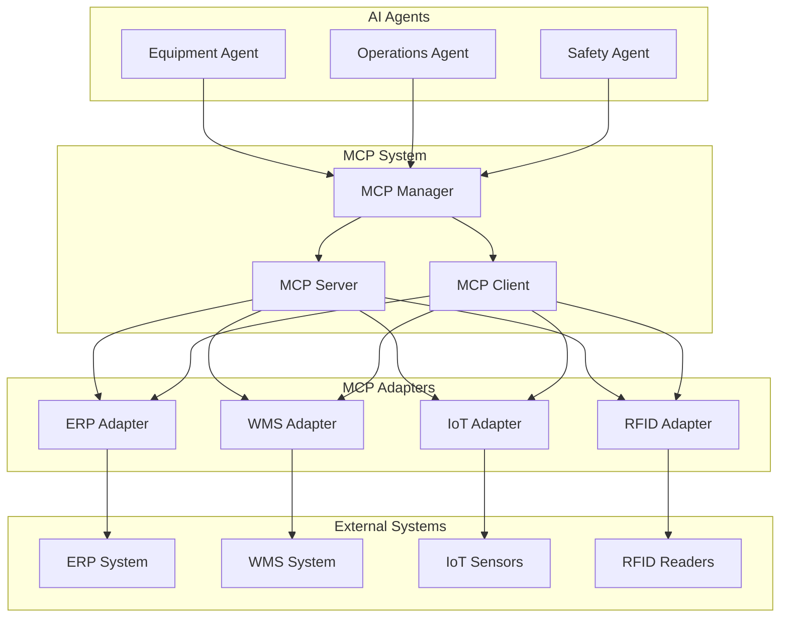

# MCP (Model Context Protocol) Integration

## Overview

The Warehouse Operational Assistant implements the Model Context Protocol (MCP) to enable seamless communication between AI agents and external systems. MCP provides a standardized way for AI systems to discover, access, and execute tools and resources from various adapters.

## Architecture

### Core Components

1. **MCP Server** (`src/api/services/mcp/server.py`)
   - Tool registration and discovery
   - Tool execution and management
   - Protocol compliance with MCP specification
   - Error handling and validation

2. **MCP Client** (`src/api/services/mcp/client.py`)
   - Tool discovery and execution
   - Resource access
   - Prompt management
   - Multi-server communication

3. **MCP Adapters** (`src/api/services/mcp/adapters/`)
   - ERP Adapter (`erp_adapter.py`)
   - WMS Adapter (planned)
   - IoT Adapter (planned)
   - RFID Adapter (planned)
   - Time Attendance Adapter (planned)
   - Forecasting Adapter (`forecasting_adapter.py`)

4. **Base Classes** (`src/api/services/mcp/base.py`)
   - `MCPAdapter` - Base class for all adapters
   - `MCPToolBase` - Base class for tools
   - `MCPManager` - System coordination

### System Flow



## Implementation Details

### MCP Server

The MCP Server provides the core functionality for tool management:

```python
from src.api.services.mcp import MCPServer, MCPTool, MCPToolType

# Create server
server = MCPServer(name="warehouse-assistant", version="1.0.0")

# Register a tool
async def get_equipment_status(arguments):
    return {"status": "operational", "equipment_id": arguments["id"]}

tool = MCPTool(
    name="get_equipment_status",
    description="Get equipment status by ID",
    tool_type=MCPToolType.FUNCTION,
    parameters={"id": {"type": "string"}},
    handler=get_equipment_status
)

server.register_tool(tool)

# Execute tool
result = await server.execute_tool("get_equipment_status", {"id": "EQ001"})
```

### MCP Client

The MCP Client enables communication with external MCP servers:

```python
from src.api.services.mcp import MCPClient, MCPConnectionType

# Create client
client = MCPClient(client_name="warehouse-client", version="1.0.0")

# Connect to server
await client.connect_server(
    "erp-server",
    MCPConnectionType.HTTP,
    "http://localhost:8000"
)

# Call tool
result = await client.call_tool("get_customer_info", {"customer_id": "C001"})

# Read resource
resource = await client.read_resource("customer_data")

# Get prompt
prompt = await client.get_prompt("customer_query", {"query": "find customer"})
```

### MCP Adapters

Adapters provide MCP integration for external systems:

```python
from src.api.services.mcp import MCPAdapter, AdapterConfig, AdapterType
from src.api.services.mcp.adapters import MCPERPAdapter

# Create ERP adapter
config = AdapterConfig(
    name="sap-erp",
    adapter_type=AdapterType.ERP,
    endpoint="http://sap-server:8000",
    connection_type=MCPConnectionType.HTTP,
    credentials={"api_key": "your-api-key"}
)

erp_adapter = MCPERPAdapter(config)

# Initialize and connect
await erp_adapter.initialize()
await erp_adapter.connect()

# Register with MCP server
await erp_adapter.register_tools(mcp_server)
```

## Tool Categories

### Data Access Tools
- `get_customer_info` - Retrieve customer information
- `get_order_info` - Retrieve order details
- `get_inventory_levels` - Get current inventory levels
- `get_equipment_status` - Check equipment status

### Data Modification Tools
- `create_order` - Create new orders
- `update_order_status` - Update order status
- `update_equipment_status` - Update equipment status
- `create_incident_report` - Create safety incident reports

### Analysis Tools
- `analyze_sales_data` - Analyze sales performance
- `predict_demand` - Predict future demand
- `optimize_inventory` - Optimize inventory levels
- `analyze_equipment_usage` - Analyze equipment utilization

### Reporting Tools
- `generate_sales_report` - Generate sales reports
- `generate_inventory_report` - Generate inventory reports
- `generate_equipment_report` - Generate equipment reports
- `generate_safety_report` - Generate safety reports

### Integration Tools
- `sync_inventory` - Synchronize inventory data
- `sync_orders` - Synchronize order data
- `sync_equipment` - Synchronize equipment data
- `sync_customers` - Synchronize customer data

## Resource Management

MCP resources provide access to structured data:

```python
# Register resource
server.register_resource("warehouse_config", {
    "zones": ["A", "B", "C"],
    "equipment_types": ["forklift", "conveyor", "crane"],
    "safety_protocols": ["lockout", "tagout", "confined_space"]
})

# Access resource
resource = await client.read_resource("warehouse_config")
```

## Prompt Management

MCP prompts provide templated queries and instructions:

```python
# Register prompt
server.register_prompt("equipment_query", {
    "template": "Find equipment information for: {equipment_id}. Include status, location, and maintenance history.",
    "description": "Query for equipment information",
    "arguments": ["equipment_id"]
})

# Use prompt
prompt = await client.get_prompt("equipment_query", {"equipment_id": "EQ001"})
```

## Error Handling

The MCP system includes comprehensive error handling:

```python
try:
    result = await client.call_tool("get_equipment_status", {"id": "EQ001"})
except ValueError as e:
    logger.error(f"Invalid tool arguments: {e}")
except ConnectionError as e:
    logger.error(f"Connection failed: {e}")
except Exception as e:
    logger.error(f"Tool execution failed: {e}")
```

## Monitoring and Logging

### Health Checks

```python
# Check adapter health
health = await erp_adapter.health_check()
print(f"ERP Adapter Status: {health['status']}")

# Check server health
server_info = server.get_server_info()
print(f"Server Tools: {server_info['tools_count']}")

# Check client status
client_info = client.get_client_info()
print(f"Connected Servers: {client_info['connected_servers']}")
```

### Logging

```python
import logging

# Configure MCP logging
logging.basicConfig(level=logging.INFO)
mcp_logger = logging.getLogger('src.api.services.mcp')

# Log tool execution
mcp_logger.info(f"Executing tool: {tool_name} with args: {arguments}")
```

## Security Considerations

### Authentication

```python
# Secure adapter configuration
config = AdapterConfig(
    name="secure-erp",
    adapter_type=AdapterType.ERP,
    endpoint="https://secure-erp.com/api",
    connection_type=MCPConnectionType.HTTP,
    credentials={
        "api_key": os.getenv("ERP_API_KEY"),
        "certificate": os.getenv("ERP_CERT_PATH")
    }
)
```

### Input Validation

```python
# Validate tool arguments
async def validate_arguments(self, arguments: Dict[str, Any]) -> bool:
    required_params = self.config.parameters.get("required", [])
    
    for param in required_params:
        if param not in arguments:
            raise ValueError(f"Missing required parameter: {param}")
    
    return True
```

## Performance Optimization

### Connection Pooling

```python
# Configure connection pooling
config = AdapterConfig(
    name="high-performance-erp",
    endpoint="http://erp-server:8000",
    connection_type=MCPConnectionType.HTTP,
    timeout=30,
    retry_attempts=3,
    metadata={
        "pool_size": 10,
        "max_connections": 100
    }
)
```

### Caching

```python
# Implement tool result caching
from functools import lru_cache

@lru_cache(maxsize=1000)
async def cached_get_customer_info(customer_id: str):
    return await erp_adapter.get_customer(customer_id)
```

## Testing

### Unit Tests

```python
import pytest
from chain_server.services.mcp import MCPServer, MCPTool

@pytest.mark.asyncio
async def test_tool_execution():
    server = MCPServer()
    
    async def test_handler(args):
        return f"Processed: {args['input']}"
    
    tool = MCPTool(
        name="test_tool",
        description="Test tool",
        tool_type=MCPToolType.FUNCTION,
        parameters={"input": {"type": "string"}},
        handler=test_handler
    )
    
    server.register_tool(tool)
    result = await server.execute_tool("test_tool", {"input": "test"})
    assert result == "Processed: test"
```

### Integration Tests

```python
@pytest.mark.asyncio
async def test_adapter_integration():
    config = AdapterConfig(
        name="test-erp",
        adapter_type=AdapterType.ERP,
        endpoint="http://test-erp:8000",
        connection_type=MCPConnectionType.HTTP
    )
    
    adapter = MCPERPAdapter(config)
    await adapter.initialize()
    await adapter.connect()
    
    assert adapter.connected is True
    assert len(adapter.tools) > 0
```

## Deployment

### Docker Configuration

```dockerfile
# MCP Server Dockerfile
FROM python:3.11-slim

WORKDIR /app
COPY requirements.txt .
RUN pip install -r requirements.txt

COPY src/api/services/mcp/ ./mcp/
COPY src/api/services/mcp/adapters/ ./mcp/adapters/

EXPOSE 8000
CMD ["python", "-m", "mcp.server"]
```

### Environment Variables

```bash
# MCP Configuration
MCP_SERVER_HOST=0.0.0.0
MCP_SERVER_PORT=8000
MCP_LOG_LEVEL=INFO

# Adapter Configuration
ERP_ENDPOINT=http://erp-server:8000
ERP_API_KEY=your-api-key
WMS_ENDPOINT=http://wms-server:8000
WMS_API_KEY=your-wms-key
```

## Future Enhancements

### Planned Features

1. **Advanced Tool Discovery**
   - Semantic tool search
   - Tool recommendation system
   - Dynamic tool composition

2. **Enhanced Security**
   - OAuth2 integration
   - Role-based access control
   - Audit logging

3. **Performance Improvements**
   - Async tool execution
   - Result caching
   - Load balancing

4. **Monitoring and Analytics**
   - Tool usage metrics
   - Performance monitoring
   - Error tracking

### Migration Roadmap

- **Phase 1**: Core MCP system ( Complete)
- **Phase 2**: Agent integration ( In Progress)
- **Phase 3**: Full system migration ( Planned)

## References

- [Model Context Protocol Specification](https://modelcontextprotocol.io/)
- [MCP GitHub Repository](https://github.com/modelcontextprotocol)
- [Warehouse Operational Assistant Documentation](../README.md)
